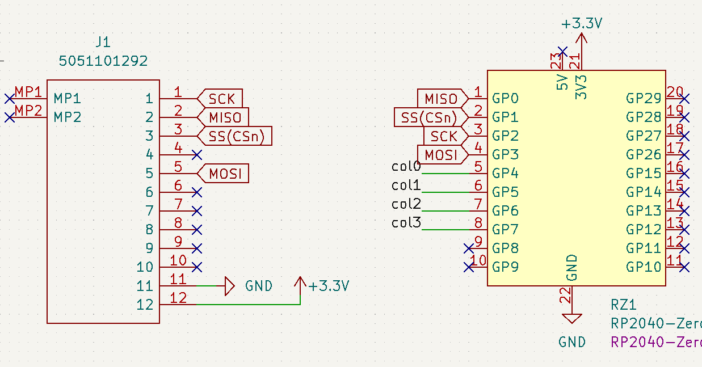

SPI で Cirque Trackpad を使うファームウェアのサンプル



* config.h
  * `// SPI の設定` のところは、使用するピンによって変える
    * `SPI_DRIVER`: `SPID0` or `SPID1`
    * 
* halconf.h
  * 特に変えるところはない
* mcuconf.h
  * 使用するピンによって、`SPI0` か `SPI1` を決める
* rules.mk

```sh
curl -X POST -H "Content-Type: application/json" -d "{\"kb\": \"cirque_sample_spi\", \"km\": \"default\", \"tag\": \"0.22.2\"}" 127.0.0.1:3123/build/qmk
```